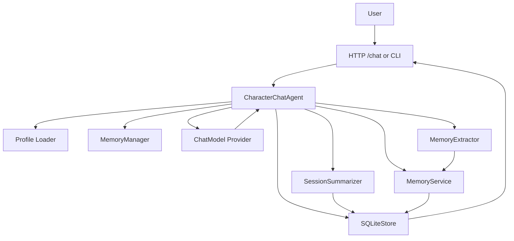

# Architecture

## Goal

Build a small, explicit runtime for a **single-character Three Kingdoms chat experience**.

The current `v0.1` scope is a local-first, memory-aware character runtime centered on one believable historical character at a time.

## Design Principles

- profile-driven character identity
- rich character profiles over shallow style prompts
- persistent sessions and local storage first
- layered memory instead of retrieval-heavy infrastructure
- provider-agnostic model wiring
- debuggable prompt assembly
- small runtime over general framework

## System Overview

Current entry points:

- HTTP server via `bun run dev`
- local CLI via `bun run chat`

Current persistence is SQLite-backed and stores:

- sessions
- messages
- long-term memory items

## Core Modules

### `CharacterChatAgent`

Owns one chat turn for one character. It loads context, assembles the prompt, calls the provider, persists the turn, triggers summary update, and triggers long-term memory extraction.

### `AgentProfile`

Defines stable character identity from local YAML configuration using `Profile Schema v1`.

Current profile sections include:

- `identity`
- `background`
- `core_values`
- `goals`
- `personality`
- `decision_policy`
- `relationships`
- `speaking_style`
- `speech_constraints`
- `response_policy`

Profile data is immutable runtime input, not generated memory.

### `MemoryManager`

Loads reply-time memory context:

- long-term memory items
- session summary

### `SessionSummarizer`

Updates the medium-term session summary when the session grows beyond the recent-message window.

### `MemoryExtractor`

Runs after a successful chat turn and proposes durable memory candidates from the recent conversation.

### `MemoryService`

Applies extracted candidates with the current lightweight policy:

- insert
- update
- skip duplicate
- discard low confidence

### `SQLiteStore`

Provides persistence for:

- sessions
- messages
- session summaries
- long-term memory items

### `AgentFactory`

Builds a configured `CharacterChatAgent` with the selected profile and provider.

### Provider Layer

Current providers:

- `fake`
- `glm`
- `bailian`

All current real providers are wired through the OpenAI-compatible chat client.

## Request Lifecycle

For one `POST /chat` request:

1. Parse and validate the request body.
2. Build the selected character agent.
3. Resolve or create the session.
4. Load and validate the schema v1 agent profile.
5. Load long-term memory and session summary.
6. Load recent messages for the session.
7. Assemble the system prompt from profile sections first, then runtime memory context.
8. Call the selected provider to generate the reply.
9. Persist the user message and assistant reply.
10. Update the session summary if the threshold is exceeded.
11. Run memory extraction for long-term memory candidates.
12. Apply extracted candidates to the SQLite memory store.
13. Return the reply and optional debug trace.

## Prompt Assembly Order

Current prompt assembly order is:

1. character profile sections:
   - identity
   - background
   - core values
   - goals
   - personality
   - decision policy
   - relationships
   - speaking style
   - speech constraints
   - response policy
2. long-term memory
3. session summary
4. recent messages

This ordering keeps richer character identity first, then durable user context, then medium-term session context, then turn-local continuity.

## Current Scope

Current implemented scope:

- single-character chat runtime
- Zhuge Liang and Cao Cao as current reference characters
- persistent sessions and message history
- layered memory:
  - long-term SQLite memory
  - session summary
  - recent messages
- automatic long-term memory extraction
- optional debug trace for chat requests
- local HTTP server and local CLI
- provider switching via `.env.local`

## Planned `v0.3` Web UI Boundary

The next planned surface is a local-first web UI for demonstration and debugging.

It should stay thin:

- serve as a visual layer over the existing HTTP API
- show profile summary, chat session, and debug trace
- avoid duplicating `CharacterChatAgent` logic in the browser

Planned additions around this UI:

- `GET /profiles`
- `GET /profiles/:agentId`

## Out Of Scope

Not currently implemented and intentionally out of scope for `v0.1`:

- multi-agent collaboration
- world-state simulation
- quest or scenario engines
- frontend UI
- vector search
- BM25 retrieval
- QMD integration
- distributed infrastructure
- plugin ecosystems
- generic orchestration frameworks
